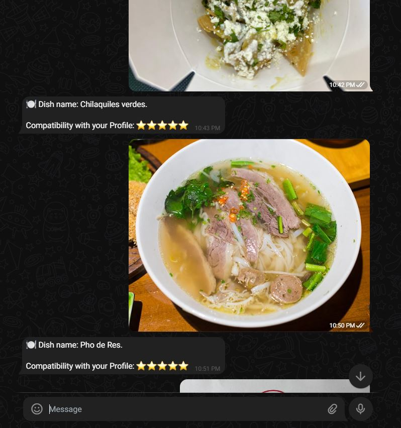

# PlateID Bot

<div style="text-align: center">
  
</div><br>

A Telegram bot designed to recognize dishes from photos, allowing users to rate them and manage their food preferences and allergies. The bot uses AI to identify the contents of a meal from an image.

## Features

- **User Registration**: Simple registration process via Telegram commands.
- **Photo-based Dish Recognition**: Upload a photo of a meal, and the bot will identify the dish.
- **Dish Rating**: Users can "like" or "dislike" dishes.
- **Allergy Management**: Users can add and list their food allergies.
- **Personalized Lists**: View lists of liked, disliked, and rated dishes.

## Architecture

This project is built with **NestJS** and follows the principles of **Hexagonal Architecture (Ports and Adapters)** and **Domain-Driven Design (DDD)**. This creates a clean separation of concerns, making the application easier to maintain, test, and scale.

The codebase is organized into modules, with each business context (like `auth` or `profile`) containing three main layers:

- `domain`: This is the core of the application. It contains the business logic, entities, value objects, and repository interfaces. It is completely independent of any external frameworks or technologies.
- `application`: This layer contains the application-specific use cases (e.g., `UserRegisterer`, `DishLiker`). It orchestrates the domain logic to fulfill specific user actions. It defines the "ports" that the outer layers connect to.
- `infrastructure`: This layer contains the implementation details and "adapters" for external systems. It includes:
  - **Telegram Handlers**: The primary entry point for user interaction, using `nestjs-telegraf`.
  - **Database Repositories**: Concrete implementations of the domain's repository interfaces, using **Google Firestore** for data persistence.
  - **AI Agents**: Connectors to external AI services (like OpenAI via LangChain) for tasks like photo recognition.

### Request Flow Example (Photo Upload)

1.  A user sends a photo to the Telegram bot.
2.  The `PhotoUpdate` handler in the `telegram` module receives the message.
3.  The handler invokes the `PhotoRecognizerAgent`.
4.  The agent processes the image and uses an AI model to identify the dish.
5.  The result is sent back to the user, who can then choose to rate the dish.
6.  If the user rates it, the corresponding `DishLiker` or `DishDisliker` use case in the `profile` module is called.
7.  The use case executes the domain logic.
8.  The `FirestoreProfileRepository` (an infrastructure adapter) persists the changes to the database.

## Getting Started

Follow these instructions to get a local copy up and running for development and testing purposes.

### Prerequisites

- [Node.js](https://nodejs.org/) (v20 or higher)
- NPM or Yarn
- A **Telegram Bot Token**. You can get one from [BotFather](https://t.me/botfather).
- **Google Cloud Platform (GCP)** project with **Firestore** enabled. You will need service account credentials (a JSON file).
- **OpenAI API Key** for the photo recognition agent.

### Installation & Configuration

1.  **Clone the repository:**

    ```bash
    git clone <repository-url>
    cd plateid-bot
    ```

2.  **Install dependencies:**

    ```bash
    npm install
    ```

3.  **Set up environment variables:**
    Create a `.env` file in the root of the project and add the following variables. Populate them with your credentials.

    ```env
    # Telegram
    TELEGRAM_BOT_TOKEN=your_telegram_bot_token
    # OpenAI
    OPENAI_API_KEY=your_openai_api_key
    ```

### Running the Application

- **Development mode with auto-reload:**

  ```bash
  npm run start:dev
  ```

- **Production mode:**

  ```bash
  # First, build the application
  npm run build

  # Then, start the production server
  npm run start:prod
  ```

### Running Tests

- **Run all unit tests:**

  ```bash
  npm run test
  ```

## How It Works

The bot is designed to be simple and intuitive. You interact with it through a series of commands and by sending a photo of your meal.

1.  **Start and Register**: Begin by interacting with the bot using the `/start` command, and register yourself with `/register`.
2.  **Send a Photo**: Take a picture of your food and send it directly to the bot.
3.  **Get an Answer**: The bot will analyze the image and tell you which dish it has identified and how compatible you are based on your preferences.
4.  **Manage Preferences**: Use commands like `/allergy <item>`, `/like <item>`, and `/dislike <item>`to add food allergies or `/list` to see your preferences.

Here is an example of the bot in action:




